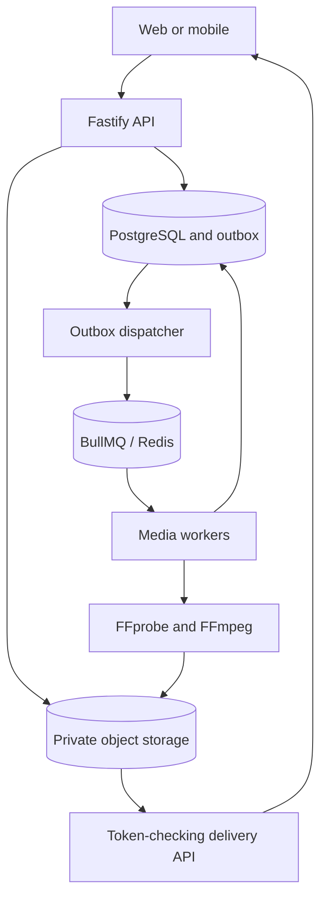

# Architecture

The API authorizes every workspace action against current membership or a hashed, scoped key. PostgreSQL owns upload and video state. Redis is a scheduling layer, not the durable record of a completed upload. Object storage holds originals and generated media; web/API/worker replicas do not share a permanent filesystem.

## Persistence and boundaries

`packages/shared` provides storage, database, queue and security primitives. `media-core` is independent of PostgreSQL and executes fixed FFmpeg argument arrays. API routes live in dedicated modules; workers orchestrate bounded media stages. Workers use per-video PostgreSQL advisory locks so duplicate delivery and cleanup cannot concurrently manipulate the same object prefix.

The dispatcher selects outbox rows with `FOR UPDATE SKIP LOCKED`, sends deterministic UUID job IDs to BullMQ, and marks rows dispatched only afterward. A dispatcher crash after enqueue can re-enqueue the same ID safely while the retained job exists. Processing state records further make stage completion idempotent. Recovery from Redis data loss requires a deliberate replay of relevant outbox records; this is not automatic exactly-once delivery.

Database entities include users/sessions/auth tokens, workspaces/members/invites, videos/uploads/parts, jobs/outbox, API keys, subtitles, chapters, webhooks/deliveries, playback sessions/events/progress, notifications/audits/usage and playlists/items. Chapters/playlists tables are preparatory; they do not imply completed product workflows.

## Realtime

Authenticated fetch-based SSE returns current processing state every two seconds. Browser reconnect obtains current state again; no event-history assumption is made. Connections close after roughly two minutes and reauthorize each snapshot. The client reconnects and refreshes tokens through the ordinary API client. This is state synchronization rather than a lossless event feed.

## Future live ingest

A separate RTMP/SRT ingest service would issue ephemeral stream credentials, push live transcoding to a dedicated resource pool, maintain a sliding HLS window in object storage/origin, and use a token-validating CDN edge. Recording finalization would create an ordinary source upload and rejoin the VOD pipeline. Live ingest is intentionally not part of this release.
