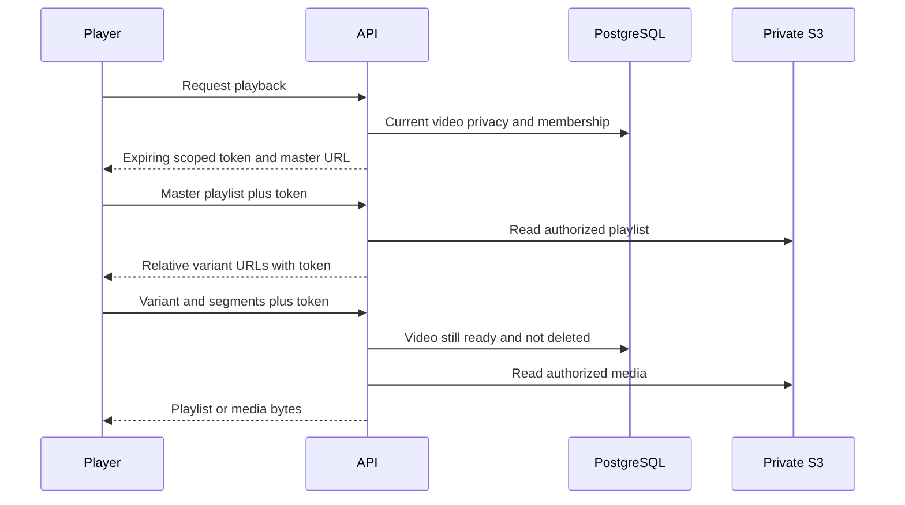

# HLS delivery

Output is VOD HLS with H.264 video and AAC stereo when the source has audio. Segments are MPEG-TS. The master advertises resolution, measured segment-based peak/average bandwidth, and codec metadata derived from the encoded stream. Every rendition has a final `EXT-X-ENDLIST` and aligned forced keyframes. Current encoding is a fixed balanced CPU preset; CMAF/fMP4, HEVC, AV1 and user-selectable profiles are future work.

Tokens have issuer/audience/expiration, video UUID, generation prefix and playback-session UUID. Media paths use a strict allowlist and cannot access source objects, unrelated videos or arbitrary bucket keys. Nested playlist URLs propagate the token. Deleting a video revokes already-issued tokens through a current-state check. Changing visibility does not revoke existing bearer links; they expire within the configured TTL (one hour by default). DRM and prevention of screen capture/download are out of scope.

The browser uses HLS.js with native HLS fallback on supported browsers. Native HTML video controls supply keyboard/accessibility/mobile playback affordances; additional controls select rendition, speed, PiP and preview scrubbing. Manual rendition selection depends on HLS.js and is not available with Safari native ABR.

Signed embeds place the token in a URL fragment, avoiding transmission in the embed-page request. The player exchanges it for tokenized media requests. Do not put permanent private tokens into published HTML. Long playback beyond token TTL currently needs retry to mint a new authorized token; shared links require a freshly issued embed. Shared-token embeds currently omit subtitle metadata even though the authorized subtitle URLs work in the dashboard.

Sources: [FFmpeg HLS muxer](https://ffmpeg.org/ffmpeg-formats.html#hls), [HLS.js](https://github.com/video-dev/hls.js).
