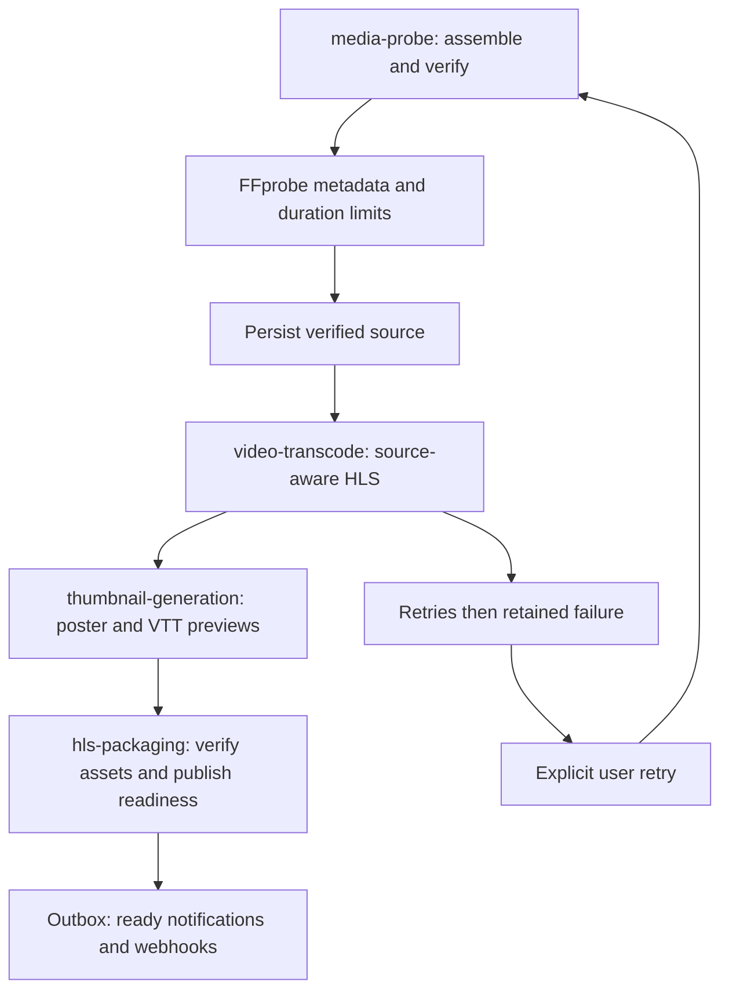

# Media pipeline

Each stage downloads the necessary input into a unique OS temporary directory, processes it, uploads outputs, commits its checkpoint and next-stage outbox row in one transaction, and removes temporary files in `finally`. Originals and outputs survive worker replacement in S3. Hard process/host termination cannot run `finally`; operators must reap old temporary directories on persistent hosts. Container replacement discards the writable layer.

A per-video advisory lock serializes stages and cleanup. BullMQ job leases renew while the Node event loop remains free; FFmpeg runs as a child process. Queue retries use exponential backoff (three attempts), stall detection, deterministic job IDs and stage checkpoint records. Final failures remain in Redis for seven days and in PostgreSQL as `dead_letter`; the UI exposes retry. Probe timeout is one minute, individual transcodes two hours, and thumbnail work five minutes. Retry configuration needs tuning for large production workloads.

No output above source dimensions is selected. The ladder uses heights 360/480/720/1080/2160 when eligible, with a single smaller even-dimension rendition for tiny sources. Rotation is honored using FFprobe side data and FFmpeg autorotation. Display aspect is scaled with square pixels; unusual anamorphic sources require additional testing. H.264/AAC MPEG-TS HLS uses four-second forced keyframe boundaries. A silent source remains silent.

FFprobe raw stream/format metadata is retained in JSON. Duration/dimensions/audio presence/codec/rotation are normalized; the raw metadata includes bitrate, frame rate, channels and color information when present. Audio language/multitrack normalization and selectable encoding profiles remain future work.

The transcode stage writes variant and master playlists; the packaging queue validates persisted playlist/poster existence and marks the video ready atomically. It does not rerun a separate muxing command. This makes the stage names reflect actual responsibilities rather than artificial empty workers. `subtitle-processing` and `analytics` are reserved queue names; current subtitle conversion and analytics ingestion are synchronous bounded API operations.
