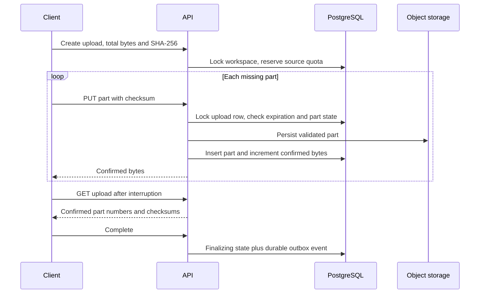

# Resumable uploads

Custom chunk protocol, not tus. Default chunk size is exactly 8,388,608 bytes except for the last chunk. Parts are zero-indexed. The server accepts raw `application/octet-stream` with `X-Checksum-Sha256` containing lowercase SHA-256 hex.

Pause aborts the browser request; a server-confirmed chunk may still finish. Resume fetches confirmed parts and safely replays duplicates. The browser incrementally hashes the source with a WASM SHA-256 implementation, never loading an entire multi-GB file into memory. Upload IDs are persisted locally by workspace plus full checksum; after reload the user reselects the same file. Hashing itself cannot instantly pause, but uploads do not begin after abort.

Identical duplicate parts are accepted without double-counting bytes. A changed checksum at the same index is rejected. Validation checks exact part size, index, expiration, upload state, workspace access, and chunk digest. Completion requires all bytes, then the worker rechecks each stored part and the complete source digest. The source is never trusted merely because a client supplied a checksum.

A failed object write does not insert a DB part. A DB rollback after object creation can leave an orphan at the deterministic part key; retry overwrites that key. Expired/cancelled/deleted videos are queued for prefix cleanup. Expiration applies to unfinished `uploading` sessions; finalizing jobs have their own retry lifecycle.

Maximum source size and duration are separate controls. Storage quota initially reserves originals only; generated bytes are recorded separately. Generated-byte and monthly bandwidth/processing enforcement remain outstanding (see status). API upload cancellation works only before finalization; video deletion cancels the remaining lifecycle.
