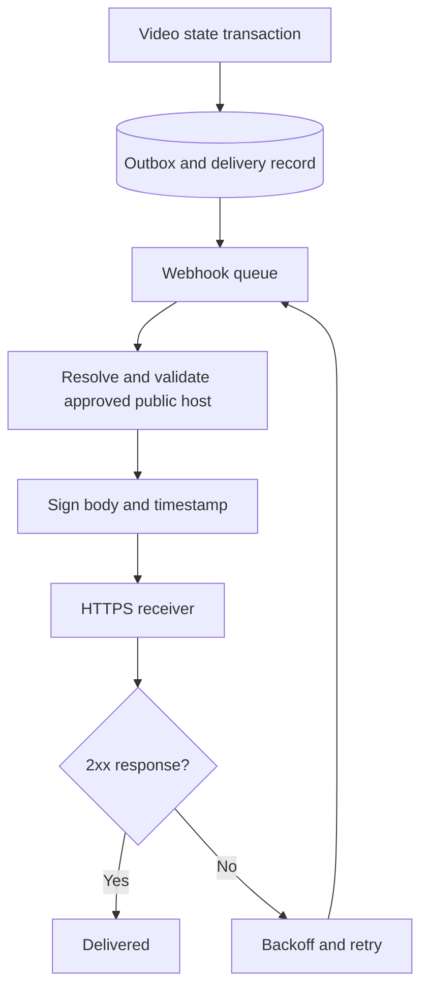

# Signed webhooks

Events: `video.upload.started`, `video.upload.completed`, `video.processing.started`, `video.processing.completed`, `video.processing.failed`, `video.ready`, `video.deleted`.

Add an exact HTTPS hostname to `WEBHOOK_ALLOWED_HOSTS`, restart API/workers, then create an endpoint as workspace admin. The signing secret is returned once. Securely configure it on the receiver. Delivery is at-least-once and events can arrive out of order; deduplicate by stable delivery ID and query video state if needed.

Headers:

```text
X-StreamForge-Id: <delivery UUID>
X-StreamForge-Timestamp: <Unix seconds>
X-StreamForge-Signature: v1=<hex HMAC-SHA256>
```

Signed bytes: `timestamp + '.' + exact raw JSON body`. Verify against the **raw** request body before parsing, reject timestamps more than five minutes from current time, use a constant-time digest comparison, and persist consumed delivery IDs. Retries reuse the same delivery ID with a fresh timestamp/signature.

Payload: `{id,event,videoId,workspaceId}`. It does not include private media URLs.

Delivery timeout is ten seconds; three attempts with exponential backoff. Only 2xx is success. Redirects are failures. PostgreSQL history stores response status and completed HTTP attempts. Network errors remain visible in BullMQ/logs but currently do not increment the database HTTP-response counter. Manual resend creates a new delivery ID with the same event payload. Disabled endpoints do not deliver queued events.


